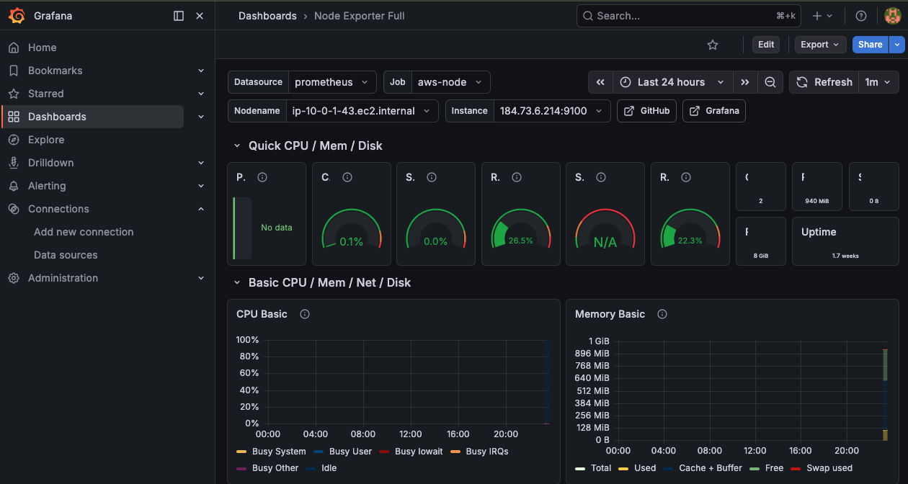

# AWS Hybrid Monitoring & Automated Remediation Lab

## What This Project Demonstrates

- End-to-end observability (Prometheus + Grafana + CloudWatch)
- Automated incident remediation via AWS SSM
- Production-style runbooks, troubleshooting, and postmortems

---

## Dashboard Preview



---

## Overview

This repository demonstrates a production-style hybrid monitoring architecture combining:

- AWS infrastructure monitoring (CloudWatch)
- Prometheus-based system telemetry
- Alertmanager alert routing
- Automated remediation via AWS Systems Manager (SSM)

The system provisions an EC2 monitoring node using Terraform, scrapes system metrics using Prometheus, and routes alerts via Alertmanager. When failures occur, automation scripts trigger remediation actions using AWS SSM.

This project demonstrates practical DevOps / SRE operational workflows, including monitoring, alerting, incident response, and automated recovery.

---

## Architecture:

Local Machine (Mac)
│
├── Prometheus
│     └── Scrapes node_exporter metrics
│
├── Alertmanager
│     └── Routes alerts based on severity
│
├── Webhook Automation
│     └── Executes remediation scripts
│
└── AWS CLI / Terraform
      │
      ▼
AWS Infrastructure
│
├── EC2 Monitoring Node
│     └── node_exporter
│
├── Elastic IP
│     └── Stable monitoring endpoint
│
├── CloudWatch
│     └── Infrastructure metrics
│
└── Systems Manager (SSM)
      └── Remote remediation execution


## Observability Architecture:

EC2 Instance
   │
   └── node_exporter
           │
           ▼
Prometheus
   │
   ├── Alert rules
   └── Metrics storage
           │
           ▼
Grafana
   │
   └── Visualization dashboards
           │
           ▼
Alertmanager
   │
   └── Routing + remediation

---

## Quick System Validation

After deploying infrastructure and starting the monitoring stack, validate the system with the following checks.

### 1. Confirm node exporter metrics

curl http://<ELASTIC_IP>:9100/metrics | head

Expected output:

HELP go_goroutines Number of goroutines

### 2. Confirm Prometheus target health

Open:
http://localhost:9090/targets

Expected status:

UP

### 3. Confirm Alertmanager readiness

curl http://localhost:9093/-/ready

### 4. Confirm Grafana dashboards

Open:

http://localhost:3000

Login:

admin/admin

Import dashboard **1860 (Node Exporter Full)**.

---

## Troubleshooting

Common operational issues and fixes are documented here:

- [Exporter Connectivity](docs/troubleshooting/exporter-connectivity.md)
- [Prometheus Target DOWN](docs/troubleshooting/prometheus-target-down.md)
- [Alertmanager Not Firing](docs/troubleshooting/alertmanager-not-firing.md)

---

## Common Commands

Start monitoring stack:

make up

Stop monitoring stack:

make down

Check system status:

make status

## System Components

| Component          | Purpose                            |
| ------------------ | ---------------------------------- |
| Terraform          | Infrastructure provisioning        |
| AWS EC2            | Monitoring target instance         |
| Node Exporter      | OS metrics collection              |
| Prometheus         | Metric scraping & alert evaluation |
| Alertmanager       | Alert routing & notification       |
| AWS SSM            | Secure remote command execution    |
| CloudWatch         | Infrastructure monitoring layer    |
| Automation Scripts | Automated remediation actions      |

---

## Operational Runbooks

Operational playbooks for responding to monitoring alerts.

Runbooks included:

| Alert                | Severity | Runbook                             |
| -------------------- | -------- | ----------------------------------- |
| NodeExporterDown     | Page     | docs/runbooks/node-exporter-down.md |
| High CPU Utilization | Ticket   | docs/runbooks/high-cpu.md           |

Location:

```bash 
docs/runbooks/
```

Each runbook documents:
- Alert description
- Detection method
- Investigation steps
- Remediation procedures
- Validation steps

---

## Incident Postmortems

Operational incidents are documented to capture lessons learned and improve system reliability.

Postmortems included:

docs/postmortems/2026-node-exporter-outage.md

---

## Monitoring Stack

Prometheus runs locally and scrapes the EC2 node exporter.

Example scrape target:

```bash
http://<ELASTIC_IP>:9100/metrics
```

Prometheus evaluates alert rules including:
- NodeExporterDown
- HighMemoryUsage
- CPU load conditions
Metrics are collected every 15 seconds.

---

## Visualization

Grafana provides dashboards for visualizing Prometheus metrics.

Access Grafana:

http://localhost:3000

Default dashboard:

Node Exporter Full (ID: 1860)

Metrics visualized:

- CPU usage
- memory utilization
- disk I/O
- filesystem usage
- network throughput

### Validation

To confirm visualization is working:

1. Ensure Prometheus target is UP:

http://localhost:9090/targets

2. Ensure exporter endpoint is reachable:

curl http://<ELASTIC_IP>:9100/metrics

3. Open Grafana and select instance:

<ELASTIC_IP>:9100

### Troubleshooting

If dashboards show no data, see:

- [Exporter Connectivity](docs/troubleshooting/exporter-connectivity.md)
- [Prometheus Target DOWN](docs/troubleshooting/prometheus-target-down.md)

---

## Alert Routing
Alertmanager routes alerts based on severity labels.

| Severity | Receiver        | Description                     |
| -------- | --------------- | ------------------------------- |
| page     | page-receiver   | Critical service failure        |
| ticket   | ticket-receiver | Non-critical operational issues |

Alert grouping reduces duplicate alerts and prevents alert storms.

---

## Automated Remediation

When critical alerts occur:

1. Prometheus fires alert
2. Alertmanager triggers webhook
3. Webhook executes remediation script
4. Script sends command via AWS SSM
5. EC2 instance executes recovery action

Example remediation:

Restart node exporter automatically.

```bash
sudo systemctl restart node_exporter
```

---

## Hybrid Observability

The system combines two monitoring layers.

### Infrastructure Layer

AWS CloudWatch

Metrics:

- CPUUtilization
- Instance health
- Network throughput

Resolution:

1 minute

---

### Node Layer

Prometheus + node_exporter

Metrics:

- CPU states
- Memory usage
- Disk I/O
- Filesystem usage

Resolution:

15 seconds

---

### Benefit
Combining both provides:

- Fast telemetry (Prometheus)
- Infrastructure validation (CloudWatch)
- Reduced monitoring blind spots

---

## Infrastructure Deployment

Infrastructure is provisioned using Terraform.

Directory:

```bash
infra/terraform
```
Deploy infrastructure:

```bash
./tf.sh apply -var-file=terraform.tfvars
```
Outputs include:

```bash
elastic_ip
instance_id
```
Elastic IP provides a stable monitoring endpoint.

---

## Monitoring Stack Deployment

Monitoring services run locally via Docker Compose.

Start monitoring stack:

```bash
cd monitoring
docker compose up -d
```
Services exposed:
| Service      | URL                                            |
| ------------ | ---------------------------------------------- |
| Prometheus   | [http://localhost:9090](http://localhost:9090) |
| Alertmanager | [http://localhost:9093](http://localhost:9093) |

---

## Evidence Collection

Operation validation artifacts are stored under:

```bash
lab/evidence/
```
Examples:

```bash
day08_cloudwatch_cpu.json
day09_prometheus_cpu_during_load.json
day10_remediation_log.txt
day11_prometheus_alerts.json
```
These demonstrate:
- Monitoring validation
- Alert triggering
- Automated remediation
- Hybrid telemetry comparison

---

## Project Progress
Development progress is documented in:

```bash
docs/operations/progress-log.md
```
This file records:
- lab milestones
- configuration changes
- operational insights
- incident validation results

---

## Snapshot Checkpoints
Milestone checkpoints are stored as Git tags.

Example tags:

```bash
day06-reproducibility-baseline
day07-alert-routing-baseline
day08-hybrid-observability
day09-load-validation
day10-auto-remediation
day11-operational-runbooks
```
Tags allow restoring the repository to any validated milestone.

---

## Directory Structure

aws-hybrid-monitoring-remediation-lab
│
├── docs
│   └── operations/progress-log.md
│
├── automation
│   ├── scripts
│   └── logs
│
├── docs
│   └── runbooks
│
├── infra
│   └── terraform
│
├── monitoring
│   ├── prometheus
│   └── alertmanager
│
└── lab
    └── evidence

---

## Key DevOps Practices Demonstrated

- Infrastructure as Code (Terraform)
- Monitoring and alerting design
- Alert routing and severity classification
- Automated remediation workflows
- Hybrid observability architecture
- Incident runbook documentation
- Evidence-based operational validation

---

## Author

This project is part of a DevOps / SRE portfolio demonstrating real-world monitoring and automation workflows.

---

## Cost Guardrails

See: admin/COST-GUARDRAILS.md

## License

MIT License
